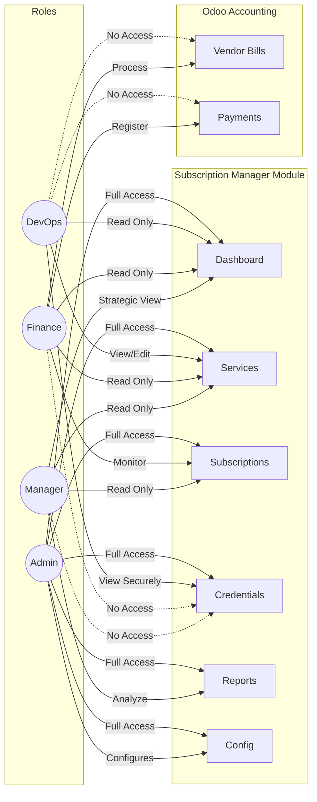

# 🏗️ System Architecture — Subscription Manager

## 1. High-Level Architecture
The **Subscription Manager** is designed as a distinct Odoo addon (`sm`) that leverages Odoo Core features without modifying them. It acts as a bridge between technical infrastructure monitoring and financial accounting.

```mermaid
graph TD
    subgraph "Odoo Core (Community 19)"
        Users[res.users]
        Partner[res.partner<br/>(Vendors/Clients)]
        Acc[Accounting<br/>(account.move, account.payment)]
        Mail[Discuss/Activity<br/>(ir.activity)]
    end

    subgraph "Subscription Manager Addon (sm)"
        Service[sm.service<br/>(Inventory)]
        Sub[sm.subscription<br/>(Contracts)]
        Cred[sm.credential<br/>(Access)]
        Crit[sm.criticality<br/>(Risk Model)]
    end

    subgraph "External World"
        DevOps[DevOps / Infra]
        FinanceExt[Finance Team]
        VendorPortal[Vendor Portals]
    end

    %% Relationships
    Partner -->|Provided By| Service
    Service -->|Has| Sub
    Service -->|Has| Cred
    Service -->|Has| Crit
    Acc -->|Pays For| Sub

    %% Interactions
    DevOps -->|Manages| Service
    DevOps -->|Reads| Cred
    FinanceExt -->|Pays| Acc
    FinanceExt -->|Monitors| Sub

    %% Core Dependencies
    Sub -.->|Uses| Partner
    Sub -.->|Linked To| Acc
    Sub -.->|Triggers| Mail
```

### Key Components
*   **Odoo Core:** Acts as the Single Source of Truth for Master Data (Partners, Currencies) and Financials (Bills, Payments).
*   **Subscription Manager (Custom):** Handles the logic for Service inventory, Lifecycle tracking, and Risk management.
*   **External World:** Human actors (DevOps, Finance) who interact with the system based on their roles.

---

## 2. Role Interaction Diagram
This diagram illustrates how different user roles interact with the system components, enforcing the "Least Privilege" principle.



### Access Control Highlights
*   **DevOps:** Focused on operational uptime (`Services`) and access (`Credentials`). Blind to financial execution details.
*   **Finance:** Focused on payment obligations (`Subscriptions`, `Bills`). Blind to technical secrets (`Credentials`).
*   **Manager:** Focused on high-level risk and cost (`Dashboard`, `Reports`). Read-only access to operations.
