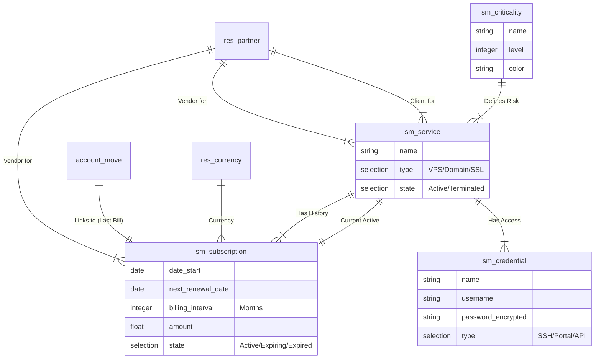

# 🗄️ Entity Relationship Diagram (ERD)

## 1. Data Model Overview
The data model is built to minimize redundancy with Odoo Core. Custom models (`sm.*`) are used only when no suitable standard model exists.

---

## 2. Entity Specifications

### `sm.service` (Service Registry)
*   **Description:** The central inventory item being monitored.
*   **Key Relationships:**
    *   `partner_id`: Many2one to `res.partner` (Vendor).
    *   `client_id`: Many2one to `res.partner` (Client/Customer) - *Optional*.
    *   `subscription_ids`: One2many to `sm.subscription` (History).
    *   `credential_ids`: One2many to `sm.credential`.
    *   `criticality_id`: Many2one to `sm.criticality`.

### `sm.subscription` (Subscription Contract)
*   **Description:** Represents the billing cycle and financial obligation.
*   **Key Fields:**
    *   `date_start`: Date.
    *   `next_renewal_date`: Date (Computed/Editable).
    *   `billing_interval`: Integer (Months).
    *   `amount`: Float (Estimated cost).
    *   `state`: Selection (Active, Expiring Soon, Expired) - *Computed*.
*   **Key Relationships:**
    *   `service_id`: Many2one to `sm.service`.
    *   `last_bill_id`: Many2one to `account.move` (Latest linked bill).

### `sm.credential` (Access Repository)
*   **Description:** Secure storage for technical access details.
*   **Security:** Field-level security rules applied (Hidden from Finance/Manager).
*   **Key Fields:**
    *   `type`: Selection (SSH, Portal, API Key).
    *   `secret`: Char (Encrypted/Password widget).

### `sm.criticality` (Risk Level)
*   **Description:** Configurable risk levels for prioritization.
*   **Fields:** `name` (e.g., "Mission Critical"), `alert_days` (default reminder threshold).
