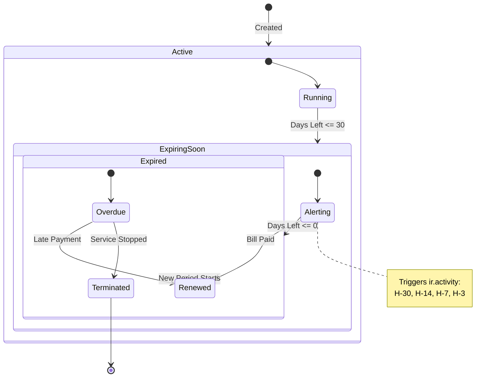
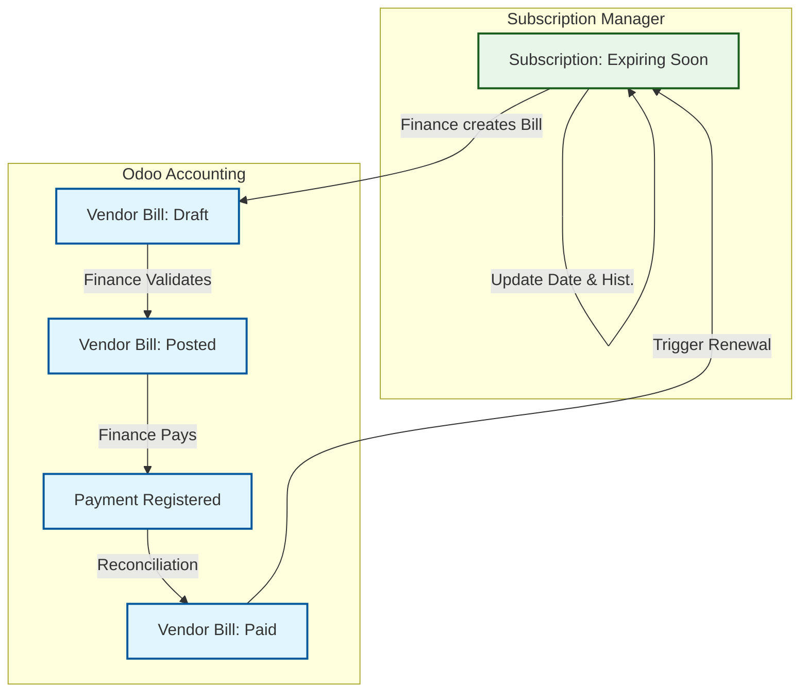

# 🔄 Workflows — Subscription Manager

## 1. Subscription Lifecycle
This workflow defines the state transitions of a subscription, driven by time and payment events.

### Key Rules
*   **Automatic Transitions:** `Active` → `Expiring Soon` → `Expired` are driven purely by time (cron jobs).
*   **Manual/Event Transitions:** `Renewed` is triggered by a Payment event. `Terminated` is a manual decision.

---

## 2. Vendor Bill & Renewal Flow
This flowchart details how the Accounting module triggers a subscription renewal.

### Integration Logic
1.  **Manual-First:** The Vendor Bill is typically created manually by Finance based on the Vendor's invoice.
2.  **Linking:** The Bill must be linked to the `sm.subscription` record (Many2one).
3.  **Trigger:** The Subscription Manager listens for the `account.move` state change to `paid`.
4.  **Action:** Upon `paid` status, the Subscription logic adds the billing interval to the `next_renewal_date`.
